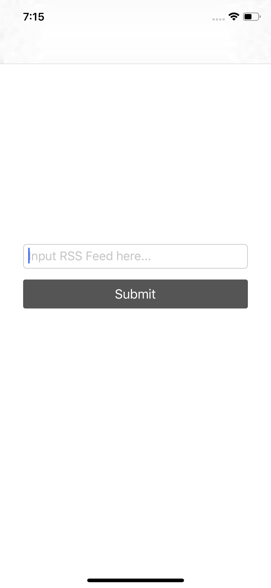
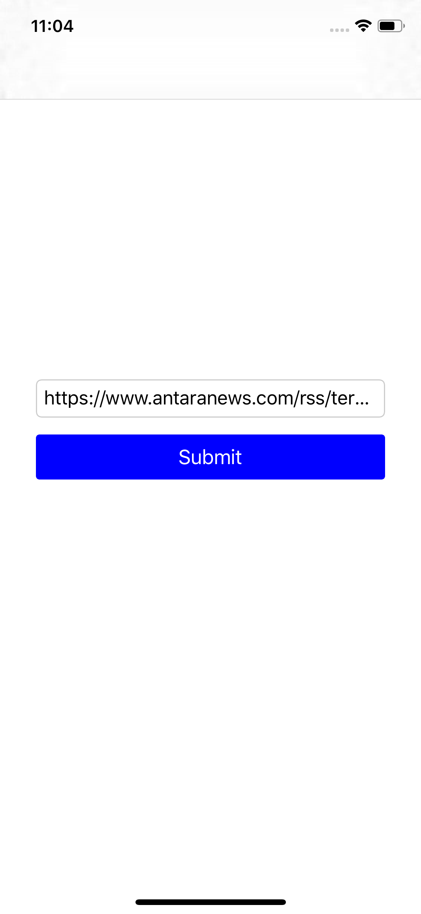
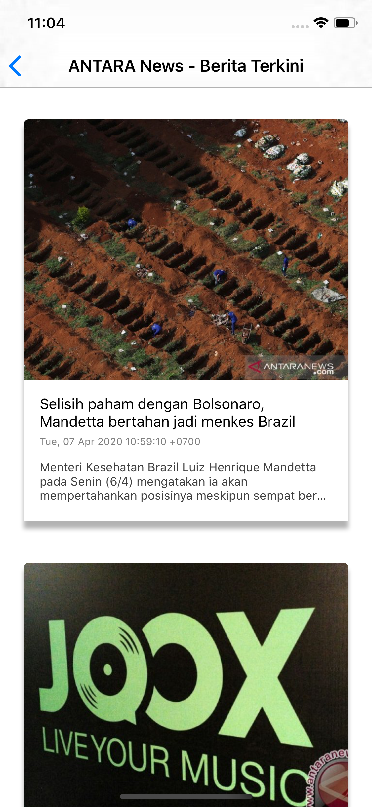

# SimpleRSS
This repo is the answer of TrueMoney take home test.

### Special Notes:
- Please run `$ pod install` after cloning this repo from GitHub or downloading it from email. It should ensure the podfiles are installed correctly for the project.
- All the pages has been designed according to the mockup in the challenge doc and I made some improvements.

### Check List:
#### Minimum Viable Product:
- [x] Aplikasi sangat sederhana berupa aplikasi RSS Feed Parser.
- [x] Aplikasi tersebut memungkinkan User untuk input RSS URL.
- [x] Ketika RSS URL di-submit, maka list item RSS dapat ditampilkan pada halam berikutnya.
#### Aplikasi dapat memenuhi:
- [x] Menggunakan framework MVVM.
- [ ] Unit testing.
#### Nice to have:
- [x] Dapat menampilkan image setiap item jika ada.
- [ ] Ada fungsi Load to refresh.

### Screenshots:
- Home screen 1:

- Home screen 2:

- Main screen:

